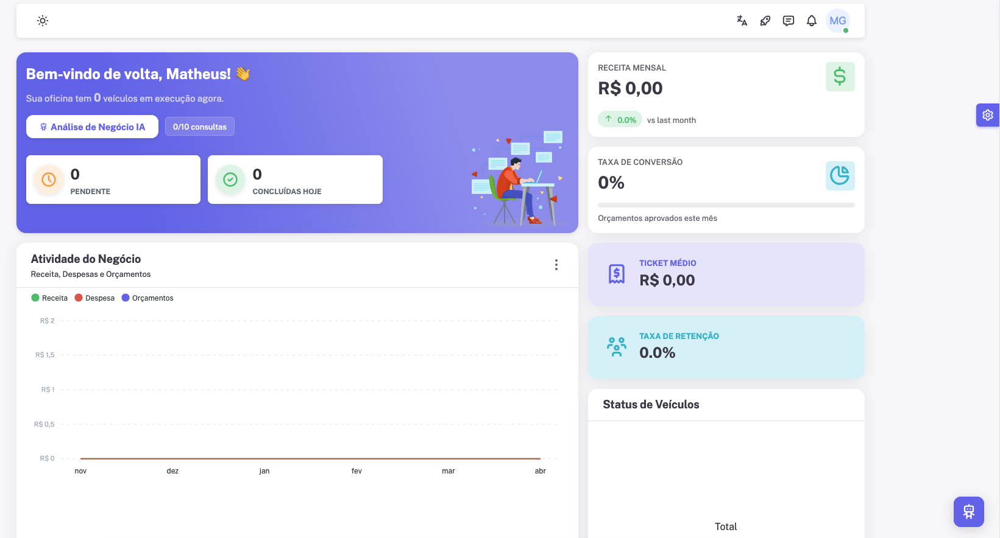
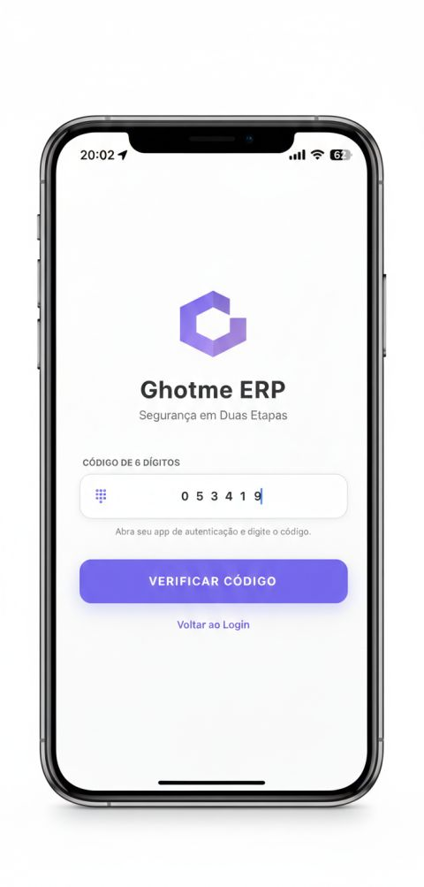
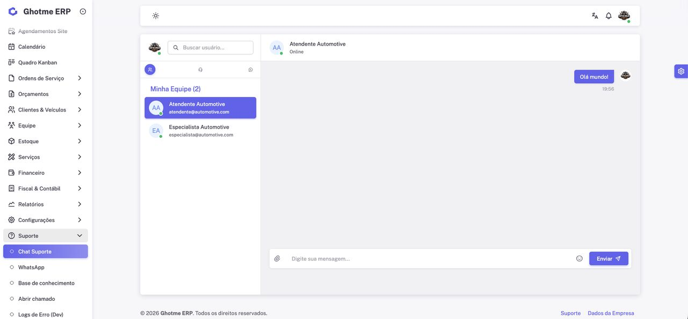
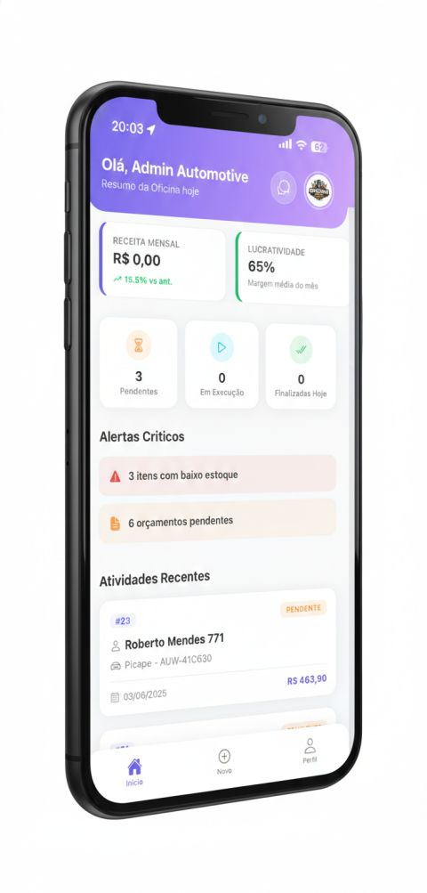
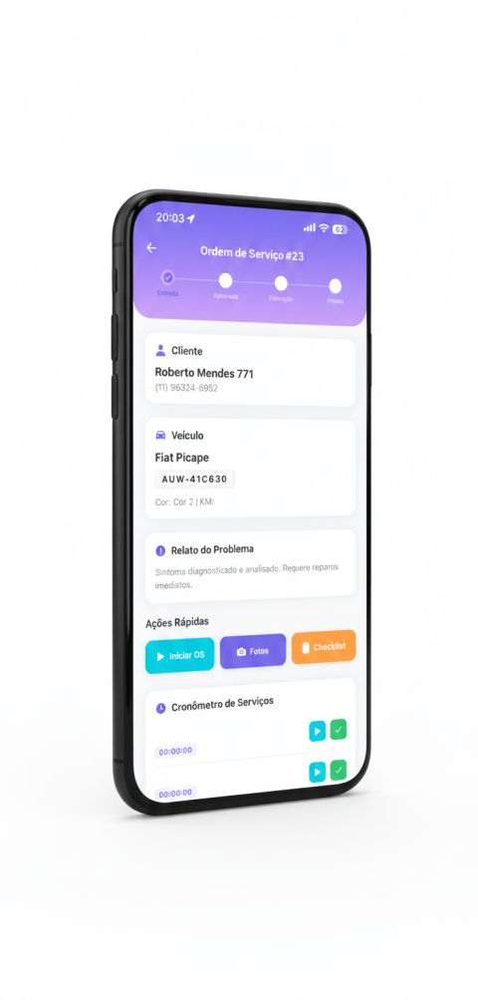
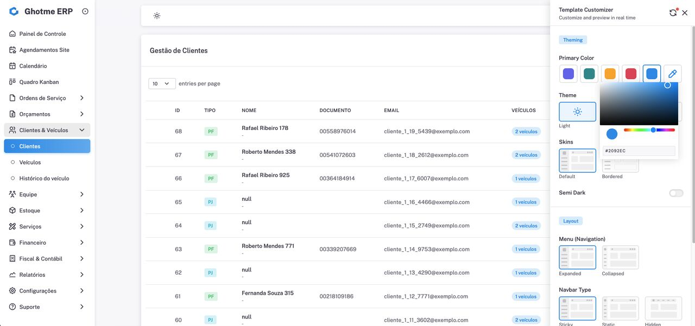

<div align="center">

# Ghotme ERP

**Modern · Multi-Tenant · Multi-Niche SaaS Platform**

[](https://www.ghotme.com.br)
[](https://laravel.com)
[](https://php.net)
[](https://aws.amazon.com)
[](https://github.com/features/actions)
[]()

> A next-generation SaaS ERP that adapts its entire interface and business logic to different industries — from automotive workshops to beauty clinics.

🔗 **[Live Demo → www.ghotme.com.br](https://www.ghotme.com.br)**

</div>

---

## 📸 Screenshots

### 🖥️ Web
<p>
  
  <br/><br/>
  
  <br/><br/>
  
  <br/><br/>
  
</p>

### 📱 Mobile
<p>
  
  &nbsp;&nbsp;
  
  &nbsp;&nbsp;
  
</p>

### 🚀 Onboarding
<p>
  
</p>

---

## ✨ Key Features

| Feature | Description |
|---|---|
| 🏢 **Multi-Tenancy** | Full data isolation per company in a shared database environment |
| 🔧 **Multi-Niche Engine** | Adapts UI and logic for Automotive, Pet Shops, Electronics Repair, and Beauty Clinics |
| 👤 **Customer Portal** | Clients track service orders, approve quotes, and view history |
| 📱 **Mobile App** | React Native/Expo — dashboard, service orders with timer, quick actions, push notifications |
| 🔐 **Two-Factor Auth** | 6-digit TOTP authentication for enhanced security |
| 💬 **Internal Chat** | Real-time team messaging via Laravel Reverb / Pusher |
| 💰 **Financial Module** | Full cash flow, accounts payable/receivable, and tax invoice (NFe) generation |
| 📅 **Online Booking** | Public landing pages for appointments synced with the admin calendar |
| 🎨 **Theme Customizer** | Real-time UI customization — colors, skins, layout, navbar type |
| 🤖 **AI Analysis** | LLM-powered business insights and intelligent process automation |
| ⚡ **Kanban Board** | Visual service order management with drag-and-drop |
| 📊 **Reports & Analytics** | Revenue, conversion rate, retention, and profitability dashboards |

---

## 🛠 Tech Stack

### Backend
- **Laravel 12** + **Livewire 3** (TALL Stack)
- **PHP 8.2** on **AWS EC2** (Ubuntu 22 + Nginx)
- **MySQL 8** via **AWS RDS**
- **AWS Lambda** (Python) + **AWS SES** for transactional email
- **AWS API Gateway** for serverless endpoints
- **Laravel Pulse** for real-time production monitoring

### Frontend
- **Vuexy Admin Template** (Premium UI/UX)
- **Vue.js** + **TypeScript**
- **Tailwind CSS**

### Mobile
- **React Native** / **Expo**

### DevOps & Infrastructure
- **AWS EC2** — production server
- **AWS S3** — static assets & file storage
- **AWS Lambda + SES** — serverless email pipeline
- **GitHub Actions** — CI/CD with zero-downtime deploy on push to `main`
- **Docker** — local development environment
- **Let's Encrypt / Certbot** — SSL/HTTPS
- **Elastic IP** — static addressing

---

## 🏗 Architecture Overview

```
┌─────────────────────────────────────────────────────┐
│                   Client / Browser                   │
└──────────────────────────┬──────────────────────────┘
                           │ HTTPS
┌──────────────────────────▼──────────────────────────┐
│              AWS EC2 (Ubuntu 22 + Nginx)             │
│                  Laravel 12 / PHP 8.2                │
│              Multi-Tenant Application Core           │
└────────┬──────────────┬──────────────┬──────────────┘
         │              │              │
    ┌────▼────┐   ┌─────▼─────┐  ┌────▼────────────┐
    │ AWS RDS │   │  AWS S3   │  │   AWS Lambda    │
    │ MySQL 8 │   │  Storage  │  │  + SES (Email)  │
    └─────────┘   └───────────┘  └─────────────────┘
```

---

## 🚀 Getting Started (Local Dev)

### Requirements
- PHP 8.2+
- Composer
- Node.js 20+
- Docker (optional)

### Installation

```bash
git clone https://github.com/matheus-voltz/Ghotme-ERP.git
cd Ghotme-ERP

cp .env.example .env
composer install
npm install

php artisan key:generate
php artisan migrate --seed

npm run dev
php artisan serve
```

### Docker

```bash
docker-compose up -d
```

---

## 🌍 Supported Niches

| Niche | Status |
|---|---|
| 🔧 Automotive Workshops | ✅ Live |
| 🐾 Pet Shops | ✅ Live |
| 📱 Electronics Repair | ✅ Live |
| 💆 Beauty Clinics | ✅ Live |

---

---

## 🇫🇷 Version Française

**Ghotme ERP** est une plateforme SaaS de nouvelle génération conçue pour centraliser la gestion des entreprises de services. Grâce à une architecture multi-locataire robuste et un moteur multi-niche unique, elle adapte toute son interface et sa logique métier à différents secteurs.

### Fonctionnalités Principales

| Fonctionnalité | Description |
|---|---|
| 🏢 **Multi-Tenancy** | Isolation complète des données par entreprise |
| 🔧 **Moteur Multi-Niche** | Adapté pour Automobile, Animaleries, Réparation Électronique et Cliniques Esthétiques |
| 👤 **Portail Client** | Suivi des ordres de service, approbation de devis, historique |
| 📱 **Application Mobile** | React Native/Expo — gestion d'équipe, chat interne, notifications push |
| 💰 **Module Financier** | Flux de trésorerie complet, comptes fournisseurs/clients, facturation |
| 📅 **Réservation en Ligne** | Pages publiques pour rendez-vous synchronisées avec le calendrier |
| 🤖 **Intégration IA** | Extraction de données et automatisation via LLM |
| ⚡ **Temps Réel** | Chat et notifications via Laravel Reverb / Pusher |

### Stack Technique

- **Backend:** Laravel 12, PHP 8.2, MySQL 8
- **Infrastructure:** AWS EC2, RDS, S3, Lambda, SES, API Gateway
- **Frontend:** Vue.js, TypeScript, Tailwind CSS
- **Mobile:** React Native / Expo
- **CI/CD:** GitHub Actions — déploiement sans interruption

### Niches Supportées

| Niche | Statut |
|---|---|
| 🔧 Ateliers Automobiles | ✅ En production |
| 🐾 Animaleries | ✅ En production |
| 📱 Réparation Électronique | ✅ En production |
| 💆 Cliniques Esthétiques | ✅ En production |

---

## 📄 License

Private — All rights reserved © Ghotme Auto Center

---

<div align="center">
  Built with ❤️ by <a href="https://github.com/matheus-voltz">Matheus Voltz</a>
</div>
